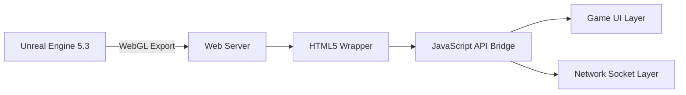
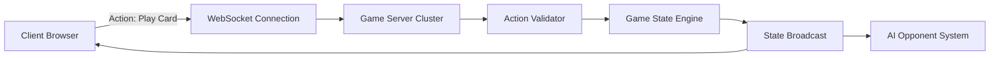
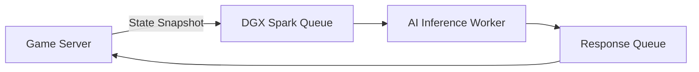
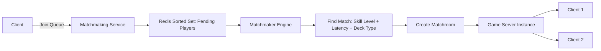
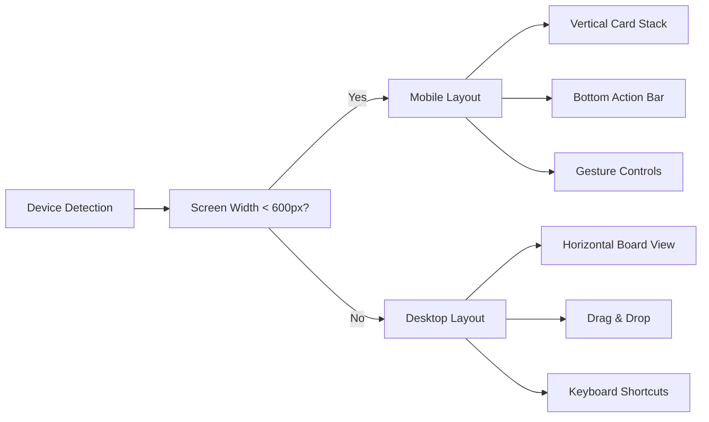
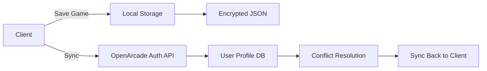

# Endless Modular TCG: Trading Card Brawl

## Technical Architecture

### 1. Unreal Engine 5.3 Integration (WebGL Export Target)

**Implementation Approach:**
- Use Unreal Engine 5.3's built-in WebGL export capabilities
- Configure project for optimized web deployment:
  - Enable `WebGL 2.0` rendering
  - Set texture compression to `ETC2` for mobile compatibility
  - Enable `Code Optimization` and `Stripping` for minimal bundle size
  - Use `WebAssembly` for core game logic

**Asset Pipeline:**
- Card art: 2K PNG textures with transparent backgrounds
- Animations: Skeletal animations exported as `.glb` (GLTF format)
- Sound: OGG format for browser compatibility
- Preload assets via `FStreamableManager`

**Web Integration:**


**Performance Considerations:**
- Target 60fps on mid-tier mobile devices
- Implement dynamic resolution scaling
- Use occlusion culling for card pools
- Limit draw calls via batched rendering

### 2. Client-Server Model (Player Actions Sent to Server for Validation)

**Architecture:**


**Protocol Design:**
- Use `WebSocket` (not HTTP) for low-latency, bidirectional communication
- Protocol: JSON over WS with schema validation
- Action schema:
  ```json
  {
    "actionId": "uuid",
    "playerId": "uuid",
    "actionType": "play_card|attack|use_ability|end_turn",
    "timestamp": "ISO8601",
    "target": "card_id|player_id",
    "params": {}
  }
  ```

**Security Measures:**
- All client input is treated as untrusted
- Server validates:
  - Card availability in hand
  - Mana/cost requirements
  - Target legality
  - Turn order
  - Cooldown status
- Implement anti-cheat: Action rate limiting, pattern analysis
- TLS 1.3 encryption for all communications

### 3. AI Opponent System Using DGX Spark

**System Design:**


**Workflow:**
1. When human player ends turn, server sends game state snapshot to Redis queue
2. DGX Spark workers consume queue items
3. AI model processes state (ML model + rule-based heuristics)
4. Response (AI actions) written back to Redis with timestamp
5. Server polls Redis every 100ms for AI responses
6. AI response must be delivered within 5s (hard SLA)

**AI Model:**
- Base: Fine-tuned transformer model trained on 10M+ TCG games
- Hybrid approach: Neural net + rule engine for deterministic behaviors
- Training data: Historical player data, simulated games
- State encoding: 512-dimensional vector of game state features

**Scalability:**
- DGX Spark runs as stateless containers on Kubernetes
- Auto-scaling based on queue depth
- 5s response SLA maintained via load balancing

### 4. Card Data Structure (JSON Schema)

**Card Schema Definition:**
```json
{
  "$schema": "http://json-schema.org/draft-07/schema#",
  "title": "Card",
  "type": "object",
  "required": ["id", "name", "type", "rarity", "cost", "attack", "health"],
  "properties": {
    "id": {
      "type": "string",
      "description": "Unique card identifier (UUID)"
    },
    "name": {
      "type": "string",
      "description": "Card name"
    },
    "type": {
      "type": "string",
      "enum": ["creature", "spell", "artifact", "enchantment", "weapon"]
    },
    "rarity": {
      "type": "string",
      "enum": ["common", "uncommon", "rare", "epic", "legendary"]
    },
    "cost": {
      "type": "integer",
      "minimum": 0,
      "maximum": 20
    },
    "attack": {
      "type": "integer",
      "minimum": 0,
      "maximum": 100
    },
    "health": {
      "type": "integer",
      "minimum": 0,
      "maximum": 100
    },
    "description": {
      "type": "string",
      "description": "Card text describing abilities"
    },
    "abilities": {
      "type": "array",
      "items": {
        "type": "string",
        "enum": ["charge", "taunt", "windfury", "stealth", "divine_shield", "lifesteal", "freeze", "poison", "battlecry", "deathrattle", "enrage", "combo", "overload"]
      }
    },
    "faction": {
      "type": "string",
      "enum": ["neutral", "fire", "water", "earth", "air", "light", "dark"]
    },
    "artAsset": {
      "type": "string",
      "description": "Path to card artwork in asset bundle"
    },
    "animationAsset": {
      "type": "string",
      "description": "Path to card animation asset"
    },
    "soundAsset": {
      "type": "string",
      "description": "Path to card play sound"
    },
    "collectible": {
      "type": "boolean",
      "default": true
    },
    "isLegendary": {
      "type": "boolean",
      "default": false
    },
    "version": {
      "type": "string",
      "description": "Card version for balance patches"
    }
  }
}
```

**Data Management:**
- Cards stored in `cards/` directory as individual JSON files
- Master index: `cards/index.json` with metadata and versioning
- Versioned via semantic versioning: `v1.2.3`
- Deployed via CDN for low-latency client access
- Integrity checked via SHA256 hash on load

### 5. Matchmaking Queue (Redis-Backed)

**Architecture:**


**Redis Data Structures:**
- `matchmaking:pending:<region>`: Sorted set with score = player skill rating
- `matchmaking:players:<playerId>`: Hash with player metadata
- `matchmaking:rooms:<roomId>`: Hash with match state

**Matchmaking Algorithm:**
- Priority: Skill rating match (±50 rating)
- Secondary: Latency (<150ms ping)
- Tertiary: Deck archetype compatibility
- Timeout: 90s before fallback to casual match

**Scalability:**
- Redis cluster with 3 master nodes
- Sharded by region (NA, EU, ASIA)
- Pub/Sub for match events
- Backup: Redis persistence to disk every 60s

### 6. Mobile Responsiveness (Touch Controls, Adaptive UI)

**UI Design Principles:**
- **Touch Targets:** Minimum 48x48px interactive elements
- **Gesture Support:**
  - Tap: Select card
  - Swipe: Scroll deck/hand
  - Pinch: Zoom card view
  - Hold: Card info tooltip

**Adaptive Layout System:**


**Performance Optimizations for Mobile:**
- Dynamic asset loading based on device RAM
- Reduced particle effects on low-end devices
- Texture atlasing for card assets
- Frame rate cap: 30fps on devices < 2GB RAM

**Accessibility:**
- Color contrast ratio ≥ 4.5:1
- Font size scaling (12px min)
- Haptic feedback on key actions

### 7. Save System (Local Storage + Cloud Sync via OpenArcade Auth)

**Save Architecture:**


**Save Data Structure:**
- Player profile (deck list, collection, stats)
- Match history
- Settings
- Achievement progress

**Implementation Details:**
- Local storage: `IndexedDB` (not localStorage) for larger datasets
- Encryption: AES-256-GCM with user-specific key derived from OpenArcade auth token
- Sync Protocol:
  - Client sends `lastSyncTimestamp`
  - Server returns changes since then
  - Conflict resolution: Server wins for core data, client wins for preferences
- Offline support: Changes queued locally, synced on reconnect
- Backup: Daily encrypted snapshot to cloud storage (S3)

**Security:**
- All sync traffic over HTTPS (TLS 1.3)
- Token rotation every 24h
- Rate limiting: 5 sync attempts per minute per user

---

## Scalability Summary

| Component | Scalability Strategy |
|---------|----------------------|
| UE5 WebGL | CDN delivery, asset chunking |
| Game Server | Kubernetes auto-scaling |
| AI System | DGX Spark stateless containers |
| Redis Queue | Clustered Redis with sharding |
| Auth Sync | Rate-limited API endpoints |

## Security Summary

- All network traffic encrypted (TLS 1.3)
- Client input never trusted
- Data integrity via SHA256 hashes
- Authentication via OpenArcade JWT
- Rate limiting on all public endpoints
- Encryption at rest (AES-256)
- Regular penetration testing scheduled

---

> **Deployment Note**: All assets and code should be deployed via CI/CD pipeline with automated testing of card balance, network latency, and client-server handshake.

> **Monitoring**: Implement Prometheus + Grafana dashboards for:
> - Matchmaking queue depth
> - AI response latency
> - Client disconnect rates
> - Server CPU/memory usage
> - Redis memory usage

> **Future Expansion**: Card trading system (NFT-based) can be layered on top of this architecture using blockchain wallet integration.